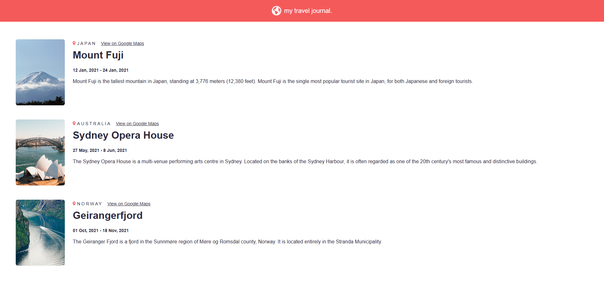
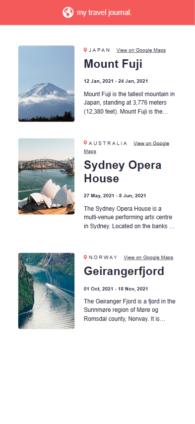

# 🌍 Travel Journal

A React project that displays a travel journal with cards for different destinations.  
Built as part of my React learning journey.

---

## 🚀 Features
- Built with [Vite](https://vitejs.dev/) ⚡
- Reusable card components
- Dynamic rendering of travel data
- Styled with CSS
- Responsive layout (desktop + mobile)

---

## 🧑‍💻 What I Learned
- Passing data to components via props
- Rendering multiple components with `.map()`
- Organizing project structure with reusable components
- Applying responsive styling

---

## 🌐 Live Demo
👉 [Travel Journal](https://travel-journal-imissh3r.vercel.app/)

---

## 📸 Screenshots

**Desktop View**  

**Mobile View**  

---

## 🙏 Credits
This project was built by following the  
[Learn React for Free course on Scrimba](https://scrimba.com/learn-react-c0e)  
taught by [Bob Ziroll](https://scrimba.com/@bobziroll).  

---

⚔️ *“When the world shoves you around, you just gotta stand up and shove back.”* — Zoro
